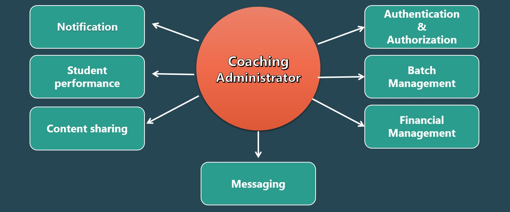
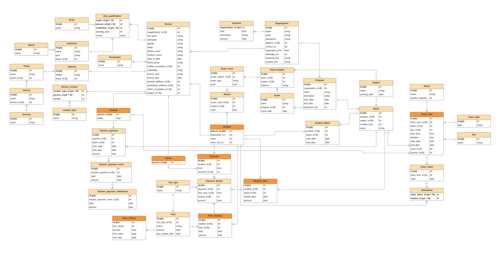

# Coaching Administrator

<h4 style='text-align:center; font-family: Cambria'><b> Watch the video</b></h4>

## Description
#### Motivation

As the world of internet progress, the need of online management  of an organization also increases day by day. In order to cope with the situation, we introduce our project idea called <b>Coaching Administrator</b> to manage coaching centers or personal tuitions. Why we chose to build such a web app, the reasons are given below shortly.

- Too much dependency on social media causes distraction from studies
- Many organizations cannot afford  a single website 
- Personal tutors fail to manage tuition efficiently 
- Provide low cost services

#### Architecture

To solve the above scenario, we designed an application consisting of routine  and batch management, attendance and fees collection, communication and many modules .

## Major Features

1. **Authentication**
   - Login
   - Forgot password
   - Registration
2. **User profile**
   - Add, modify and delete functionality
3. **Notification**
   - Routine update
   - Batch assign
   - Exam reminder
   - Class reminder
   - Exam result publish
4. **Messaging**
   - Each batch is assigned a messaging group
   - Students and teachers can text and share files
5. **Batch management**
    - Batch creation
    - Teacher and Student assign
    - Routine management
    - Exam scheduling
    - Attendance collection
6. **Student performance**
    - Exam result entry
    - Teacher’s comment
    - Monthly progress report
7. **Financial management**
    - Student’s fees entry
    - Student’s fees collection
    - Dues list generation
    - Teacher salary calculation
    - Expense account
    - Fund maintenance

## ER Diagram

## Technology

       

## Credits

  
  

